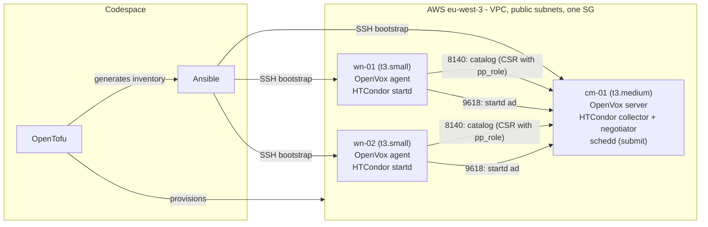

# HTCondor Batch Farm as Code

A 3-node HTCondor pool on AWS, built end to end as code:
OpenTofu provisions AlmaLinux 9 VMs, Ansible bootstraps them, an OpenVox server converges them
(Puppet roles/profiles + Hiera) into a working HTCondor pool.

> Status: work in progress.

## Goal

_TODO_

## Architecture

Each node's role is the `pp_role` trusted fact (a CSR extension), mapped to `role::<pp_role>` and then to profiles.

## Design choices

See [docs/DECISIONS.md](docs/DECISIONS.md).

## Quick start

_TODO_

## Proofs

_TODO (idempotence, drift correction, scale-out, health check, jobs, CI)_

## Cleanup

_TODO_

## Limitations

_TODO_

## What would change at CERN scale

_TODO_
