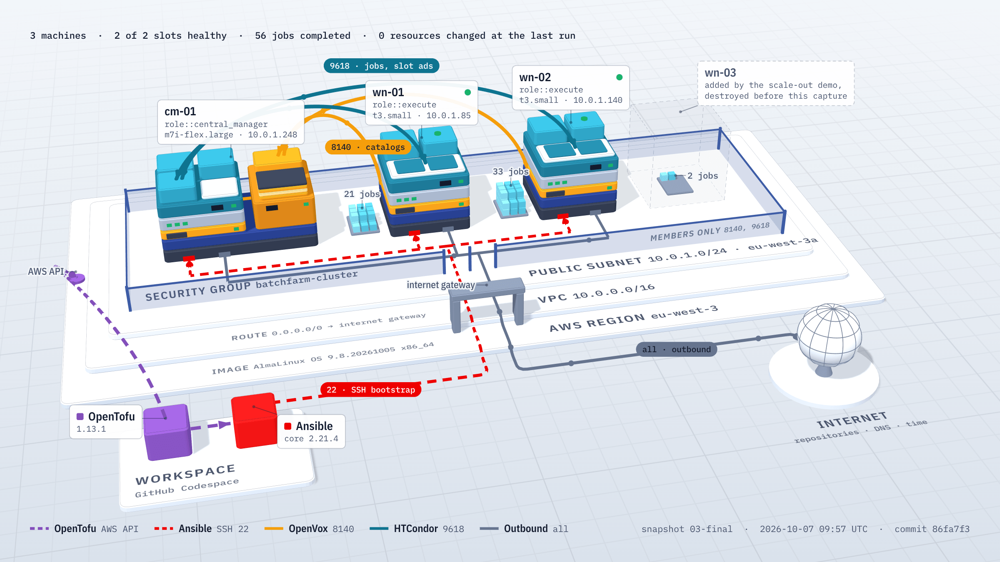
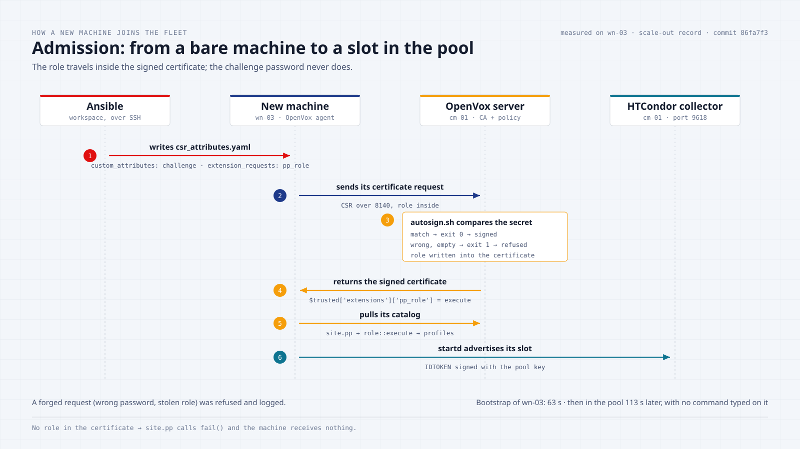
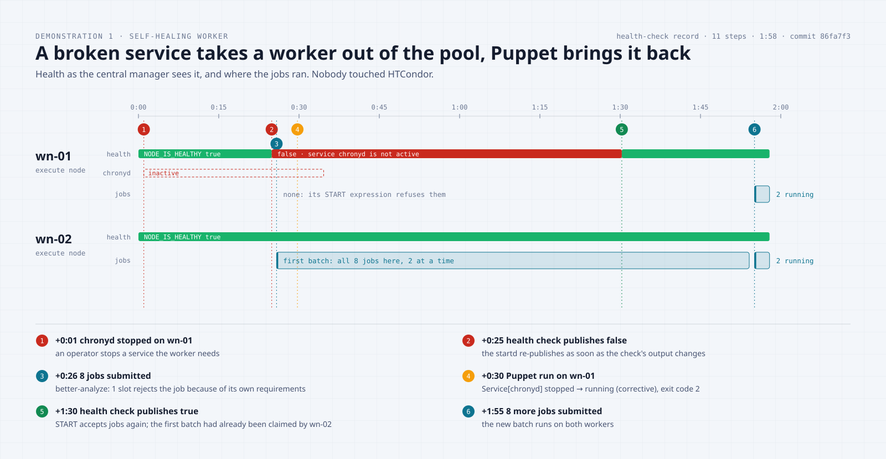
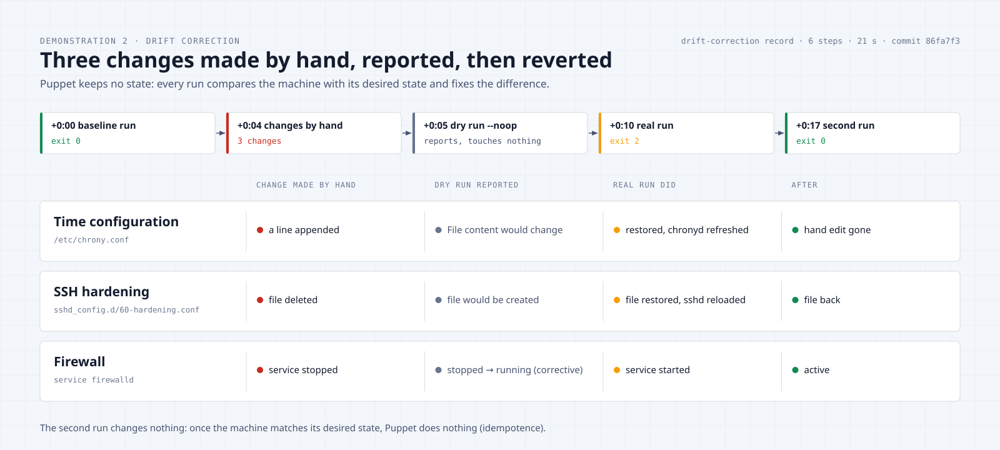
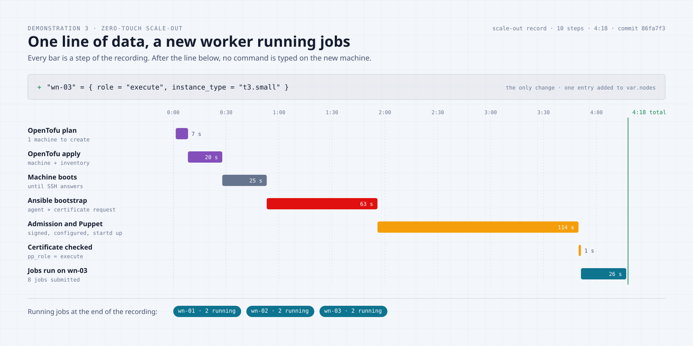

# HTCondor Batch Farm as Code

[](https://github.com/vinsl/HTCondor-Batch-Farm/actions/workflows/ci.yml)


A batch-computing farm on AWS, built, configured and operated entirely from code. **OpenTofu** creates
the machines, **Ansible** gives each one just enough to join, **OpenVox** (the open source Puppet)
configures them and keeps them configured, and **HTCondor** schedules the jobs. A worker that becomes
unhealthy removes itself from the pool, and comes back once Puppet has repaired it.

The whole lab is destroyed after every session and rebuilt from nothing in about fifteen minutes.

<a href="https://vinsl.github.io/HTCondor-Batch-Farm/docs/lab/visuals/">
  <picture>
    <source media="(prefers-color-scheme: dark)" srcset="docs/lab/visuals/hero-dark.png">
    
  </picture>
</a>

<p align="center"><sub>
The final lab, drawn from <a href="docs/lab/snapshots/03-final/SUMMARY.md">snapshot 03-final</a>: every machine, port, flow and job count in the image is read from the capture.
<b><a href="https://vinsl.github.io/HTCondor-Batch-Farm/docs/lab/visuals/">Open the interactive 3D model</a></b> to orbit around it, click any part for its details, or replay the six steps of the build.
</sub></p>

---

## At a glance

| | |
|---|---|
| **Infrastructure** | 1 VPC, 1 security group, 3 AlmaLinux 9.8 machines on AWS `eu-west-3`, defined by one map of nodes |
| **Configuration** | OpenVox 8: roles and profiles, a 3-level Hiera hierarchy plus a secrets level, EPP templates |
| **Admission** | Certificates signed by a policy script that checks a shared secret; `autosign = true` is never used |
| **Batch system** | HTCondor 25.0 LTS: collector, negotiator and schedd on `cm-01`, one startd per worker |
| **Self-healing** | A health check publishes `NODE_IS_HEALTHY`; the worker's `START` expression refuses jobs when it is false |
| **Proven by** | 56 jobs completed in the final lab, 3 recorded demonstrations, 3 complete infrastructure snapshots |
| **Gated by** | 5 CI jobs on every pull request: syntax, `puppet-lint`, `rspec-puppet` (11 examples), `ansible-lint`, `tofu validate`, Checkov, Gitleaks, Ruff, Pytest (10 tests) |

## Contents

- [How it works](#how-it-works)
- [Architecture](#architecture)
- [How a new machine joins the fleet](#how-a-new-machine-joins-the-fleet)
- [Demonstrations](#demonstrations)
- [Infrastructure snapshots](#infrastructure-snapshots)
- [Quality gates](#quality-gates)
- [Quick start](#quick-start)
- [Repository layout](#repository-layout)
- [Design decisions](#design-decisions)
- [Lessons learned](#lessons-learned)
- [Limitations](#limitations)
- [What would change at the scale of a large computing centre](#what-would-change-at-the-scale-of-a-large-computing-centre)
- [Versions](#versions)

---

## How it works

| Step | Tool | What happens | Where |
|---|---|---|---|
| 1. **Provision** | OpenTofu | Builds the network, the security group and one machine per entry of `var.nodes`, then writes the Ansible inventory from the machines it created. | [`tofu/`](tofu/) |
| 2. **Bootstrap** | Ansible | Installs the OpenVox agent and writes the certificate request attributes: the node's **role** and a **challenge password**. On the central manager it also installs the OpenVox server and its admission policy. | [`ansible/`](ansible/) |
| 3. **Admit** | OpenVox server | A policy script signs a certificate request only if its challenge password matches. The role is written **into** the signed certificate. | [`ansible/roles/openvox_server/files/autosign.sh`](ansible/roles/openvox_server/files/autosign.sh) |
| 4. **Configure** | OpenVox agents | Each agent pulls a catalog compiled for its role, applies it, and repeats every 30 minutes, reverting any manual change. | [`puppet/`](puppet/) |
| 5. **Compute** | HTCondor | Workers advertise their CPUs and memory; the negotiator matches waiting jobs with free slots. | [`puppet/site-modules/profile/`](puppet/site-modules/profile/) |
| 6. **Self-heal** | Health check | Every minute each worker checks itself and publishes the result. A sick worker refuses new jobs by itself. | [`health_check.py`](puppet/site-modules/profile/files/htcondor/health_check.py) |

Ansible bootstraps, Puppet maintains. Ansible pushes once over SSH and only does what must exist before
an agent can talk to its server; from then on, every change goes through the Puppet code.

---

## Architecture

**Reading the image at the top.** From the bottom: the workspace runs OpenTofu (purple, through the AWS
API) and Ansible (red, SSH on port 22). Inside the region, the VPC and the public subnet are stacked slabs; the
glass fence is the security group. Each machine is built layer by layer, in the order the tools install it:
instance, AlmaLinux, OpenVox agent, `profile::base`, `profile::htcondor`, then the daemons of its role. The amber
module on `cm-01` is the OpenVox server. Arcs in the air are the two flows allowed only between members of the
security group: OpenVox catalogs on 8140 (amber) and HTCondor on 9618 (teal). Cubes beside a worker are the jobs it
completed, and the dashed outline is `wn-03`, the worker of the scale-out demonstration.

```text
Workspace (GitHub Codespace)
  ├── OpenTofu ─────────► AWS eu-west-3 · VPC 10.0.0.0/16 · public subnet 10.0.1.0/24 · 1 security group
  └── Ansible (SSH) ────► bootstrap of every machine

  cm-01   m7i-flex.large   OpenVox server · HTCondor collector + negotiator · schedd (job queue)
  wn-01   t3.small         OpenVox agent  · HTCondor startd · health check
  wn-02   t3.small         OpenVox agent  · HTCondor startd · health check

  role of a machine = pp_role extension of its certificate ─► role::<pp_role> ─► profiles
```

| Flow | Port | Allowed from |
|---|---|---|
| SSH (administration) | 22 | one administrator address (`/32`), refreshed at each session |
| Agent ↔ OpenVox server | 8140 | members of the security group only |
| HTCondor daemons (shared port) | 9618 | members of the security group only |
| Outbound | all | anywhere (package repositories, DNS, time) |

Every machine also runs `firewalld`, configured by Puppet from Hiera: the central manager opens 8140
and 9618, the workers only 9618.

**Roles and profiles.** A node has exactly one role, a role is a list of profiles, and a profile
configures one technology.

| Role | Profiles |
|---|---|
| `role::central_manager` | `profile::base`, `profile::htcondor::central_manager`, `profile::htcondor::submit` |
| `role::execute` | `profile::base`, `profile::htcondor::execute` |

`profile::base` manages time synchronisation (chrony, with the Amazon Time Sync Service first), a
hardened SSH drop-in, the firewall and base packages. `profile::htcondor` holds what every HTCondor node
shares (repository, package, common configuration rendered from EPP, pool key, daemon token, service).

**Hiera.** The first file that defines a key wins:
`secrets.yaml` (not committed) → `nodes/<certname>.yaml` → `roles/<pp_role>.yaml` → `common.yaml`.

---

## How a new machine joins the fleet

<picture>
  <source media="(prefers-color-scheme: dark)" srcset="docs/lab/visuals/diagrams/admission-dark.svg">
  
</picture>

1. Ansible writes `csr_attributes.yaml` on the node: the challenge password (`custom_attributes`, used
   for admission, **not** kept in the certificate) and the role (`extension_requests`, written **into**
   the certificate).
2. The agent starts and sends its certificate request to the server.
3. The policy script compares the challenge password with the one stored on the server. Any unexpected
   case (no name, unreadable secret, empty or wrong password, garbage input) ends in a refusal, and the
   log never contains a secret.
4. Once signed, the role is a **trusted fact**: `$trusted['extensions']['pp_role']`. The node cannot change it.
5. `site.pp` includes `role::<pp_role>`. A node without a role gets **no** catalog: the compilation fails.
6. Puppet installs HTCondor, the pool key and a token minted locally from it; the startd registers at
   the collector and starts receiving jobs.

A forged request with a wrong password asking for the central manager's role was submitted to the
server during the build: it was refused and the refusal was logged.

---

## Demonstrations

Each demonstration is a scenario run against the live lab by [`docs/lab/demo.py`](docs/lab/README.md),
which records every command, its output, exit code and timestamp. All three were recorded on the
same commit, on a fleet rebuilt from scratch the same morning.

### 1. Self-healing worker

`chronyd` is stopped on `wn-01`. Its health check publishes `NODE_IS_HEALTHY = false` with the reason
`service chronyd is not active`; new jobs run only on `wn-02`, and `condor_q -better-analyze` reports that
the slots *reject the job because of their own requirements*. The next Puppet run detects the stopped
service as drift and starts it; `wn-01` publishes `true` again and the next batch runs on both workers.

**11 steps, 1 min 58 s.** Record: [`docs/lab/demos/health-check/RECORD.md`](docs/lab/demos/health-check/RECORD.md)

<picture>
  <source media="(prefers-color-scheme: dark)" srcset="docs/lab/visuals/diagrams/demo-health-check-dark.svg">
  
</picture>

### 2. Drift correction

Three changes are made by hand on `wn-01`: a line added to `/etc/chrony.conf`, the SSH hardening file
deleted, `firewalld` stopped. A dry run (`puppet agent --noop`) reports all three as drift without
touching anything; the real run reverts them and refreshes the services that depend on the corrected
files; a second run changes nothing (exit code 0).

**6 steps, 21 s.** Record: [`docs/lab/demos/drift-correction/RECORD.md`](docs/lab/demos/drift-correction/RECORD.md)

<picture>
  <source media="(prefers-color-scheme: dark)" srcset="docs/lab/visuals/diagrams/demo-drift-dark.svg">
  
</picture>

### 3. Zero-touch scale-out

One entry is added to the OpenTofu node map. The plan shows a single new machine; OpenTofu creates it
and regenerates the inventory; Ansible bootstraps it; the policy signs its request with the role
`execute`; Puppet installs and configures HTCondor; `wn-03` appears in the pool and runs jobs. No
command is typed on the new machine and no certificate is signed by hand.

**10 steps, 4 min 18 s** (1 min 53 s between the end of the bootstrap and the new slot in the pool).
Record: [`docs/lab/demos/scale-out/RECORD.md`](docs/lab/demos/scale-out/RECORD.md)

<picture>
  <source media="(prefers-color-scheme: dark)" srcset="docs/lab/visuals/diagrams/demo-scale-out-dark.svg">
  
</picture>

---

## Infrastructure snapshots

[`docs/lab/snapshot.py`](docs/lab/README.md) captures the complete state of the lab at one instant: the
AWS resources from the OpenTofu state, and on every node the system, services, listening ports,
firewall, packages, certificate and role, last Puppet run, and HTCondor daemons, slots and job history.
Each snapshot has a machine-readable `snapshot.json` and a readable `SUMMARY.md`.

| Milestone | Captured | Nodes | Summary |
|---|---|---|---|
| First working pool | 2026-10-06 | 3 | [`01-htcondor-pool`](docs/lab/snapshots/01-htcondor-pool/SUMMARY.md) |
| After the scale-out | 2026-10-07 | 4 | [`02-scaled-out`](docs/lab/snapshots/02-scaled-out/SUMMARY.md) |
| Final lab | 2026-10-07 | 3 | [`03-final`](docs/lab/snapshots/03-final/SUMMARY.md) |

In the final snapshot every agent runs, the last Puppet run changed 0 of 29–31 resources on each node,
both slots are healthy, no certificate request is pending, and 56 jobs have completed.

---

## Quality gates

The pipeline ([`.github/workflows/ci.yml`](.github/workflows/ci.yml)) runs on every pull request and on
`main`. It has no AWS credentials and deploys nothing.

| Job | Checks |
|---|---|
| Puppet | `puppet parser validate`, `puppet epp validate`, `puppet-lint` (warnings fail), `rspec-puppet` |
| Ansible | `ansible-lint` (production profile), which includes the playbook syntax check |
| OpenTofu | `tofu fmt -check`, `tofu validate` |
| Python | Ruff (lint and format), Pytest |
| Security | Gitleaks over the whole history, Checkov over the OpenTofu code |

The `rspec-puppet` tests compile real catalogs with the real Hiera hierarchy: for example, the central
manager opens port 8140 and a worker does not, `chronyd` subscribes to its configuration file, and the
health check configuration requires the script it points to. Six Checkov checks are skipped, each one
written down with its reason in [`.checkov.yaml`](.checkov.yaml).

The first run of this pipeline on `main` failed on a real defect of the workflow (two security tools
writing the same report file with different owners); it was fixed through pull request #1.

---

## Quick start

**Requirements:** an AWS account with credentials in the environment, OpenTofu ≥ 1.8, Ansible,
an SSH key pair in `~/.ssh/batchfarm`. The [devcontainer](.devcontainer/) installs every tool.

**1. Two secrets, generated once, outside the repository**

```bash
mkdir -p ~/.config/batchfarm && chmod 700 ~/.config/batchfarm
openssl rand -hex 24 > ~/.config/batchfarm/autosign_password       # admission policy
openssl rand -hex 32 > ~/.config/batchfarm/htcondor_pool_password  # HTCondor pool key
chmod 600 ~/.config/batchfarm/*
```

**2. Build**

```bash
cd tofu
echo "admin_cidr = \"$(curl -s https://checkip.amazonaws.com)/32\"" > terraform.tfvars
tofu init && tofu apply          # network, security group, 3 machines, Ansible inventory

cd ../ansible
ansible-playbook site.yml        # bootstrap, server, admission policy, agents, sample jobs
```

The agents then converge on their own; the pool is ready a few minutes later.

**3. Use**

```bash
ssh -i ~/.ssh/batchfarm ec2-user@<public address of cm-01>
condor_status                    # the slots of the two workers
cd ~/jobs && condor_submit pi.sub && condor_q
```

**4. Check**

```bash
ansible-playbook site.yml        # second run: changed=0 on every node
bundle install && bundle exec rake && pytest tests   # the CI checks, locally
python3 docs/lab/snapshot.py 04-mine "My own capture"
```

**5. Clean up**

```bash
cd tofu && tofu destroy
```

If SSH times out at the start of a session, the workspace's public address has changed: rewrite
`terraform.tfvars` and apply the SSH rule only (`tofu apply -target=aws_vpc_security_group_ingress_rule.ssh`).

---

## Repository layout

| Path | Content |
|---|---|
| [`tofu/`](tofu/) | Network module, security group, nodes (`for_each` over `var.nodes`), generated inventory |
| [`ansible/`](ansible/) | Roles `openvox_bootstrap` and `openvox_server`, playbook `site.yml` |
| [`puppet/`](puppet/) | The control repository: `manifests/site.pp`, `site-modules/{role,profile}`, `hiera.yaml`, `data/` |
| [`jobs/`](jobs/) | Sample HTCondor jobs (a short job, 20 Monte Carlo jobs, a batch of 8, and one that can never run) |
| [`spec/`](spec/), [`tests/`](tests/) | `rspec-puppet` tests of the profiles; Pytest tests of the health check |
| [`docs/DECISIONS.md`](docs/DECISIONS.md) | 13 design decisions: context, decision, rejected alternative, what changes at scale |
| [`docs/lab/`](docs/lab/README.md) | Recording tools, demonstration records, infrastructure snapshots and the 3D model of the lab (`visuals/`) |
| [`.github/workflows/ci.yml`](.github/workflows/ci.yml) | Continuous integration |

---

## Design decisions

Every non-trivial choice is written down in [`docs/DECISIONS.md`](docs/DECISIONS.md). The main ones:

- **Admission by policy, never `autosign = true`**, with a fail-closed script (decision 004).
- **The role comes from the certificate**, not from a fact the node declares.
- **Secrets never enter git**: generated outside the repository, written on the server by Ansible,
  read by Hiera as `Sensitive`.
- **HTCondor security** with a pool key, locally minted IDTOKENS and one trust domain for the pool.
- **The health check fails closed**: `START` requires `NODE_IS_HEALTHY =?= True`, so a missing attribute refuses jobs.
- **Lab compromises, stated as such**: public subnet without NAT, OpenVox server on the central manager,
  code deployed by copy instead of r10k.

---

## Lessons learned

The most useful part of the project was what broke. Each of these was found on the live lab, diagnosed
from the logs, fixed in code, and is now covered by the recorded evidence.

| What broke | Root cause | Fix and lesson |
|---|---|---|
| Workers never appeared in `condor_status`, the startd log said `Failed to authenticate` | The pool key alone is not enough; each daemon needs a token, and a token minted on a worker carried the worker's name as its trust domain | Tokens minted locally on every node and `TRUST_DOMAIN = $(CONDOR_HOST)` everywhere. *Read the daemon log before changing configuration.* |
| On a fresh rebuild, the central manager's agent waited 30 minutes before its first configuration | The agent was started as soon as the server's service was "started", but the JVM listens on 8140 a minute or two later | The playbook now waits for the port. *A started service is not a ready service; only a full rebuild showed it.* |
| One agent had never started | The agent was started only by a handler; the first run failed before the handler, later runs changed nothing | A final play ensures every agent runs. *Handlers react to change, they do not guarantee state.* |
| The health check passed its 10 tests but crashed on a real node | A tuple was passed where one service name was expected; the tests replaced that function with a fake | Fixed, and the script was run on a real node. *Mocks do not check the arguments you pass them.* |
| A sick node still looked healthy at the central manager for minutes | The startd sends its advertisement every 300 seconds | `STARTD_CRON_AUTOPUBLISH = If_Changed`. *Measure how fast a signal really propagates.* |
| The OpenVox server refused to start | It runs as user `puppet` and could not read a file created as root-only | Group `puppet`, mode `0640`. *Know which account a service runs as.* |
| `t3.medium` was refused, HTCondor packages failed to install, a repository's metadata signature was reported bad | AWS free-plan restrictions, missing EPEL dependencies, an upstream signature problem | Eligible instance type, EPEL as an explicit prerequisite, metadata check relaxed while package signatures stay verified. Each is a recorded decision. |

What I learned in the process, beyond the tools themselves: **declarative state versus ordered
steps** (Puppet compares, Ansible executes), **why the source of a fact matters** (a role a node declares
is not a role you can trust), **fail closed everywhere** (admission, node role, health), and **evidence
over claims** (every statement in this README links to a record of it happening).

---

## Limitations

- **One shared admission secret.** It proves membership of the fleet, not the identity of one machine,
  and the node chooses its own role in its request.
- **The HTCondor pool key appears in the compiled catalog**, because it is passed to a command through
  an environment variable. The cached catalog is readable by root only and travels over TLS, but a
  secret store or encrypted Hiera data would be the right tool.
- **The OpenVox server shares a machine with the central manager**: a single point of failure.
- **The control repository is deployed by a file copy**: removed files are not deleted and nothing
  pulls changes.
- **Single availability zone, public subnet without NAT, no monitoring stack**: cost and scope choices.

## What would change at the scale of a large computing centre

- **Provisioning and lifecycle** by a system such as Foreman, with machines enrolled at creation, instead
  of OpenTofu and Ansible driving a handful of machines.
- **PuppetDB** for facts, reports and queries over the whole fleet.
- **Environments and review**: one environment per git branch (r10k or Code Manager), changes promoted
  through a canary group before the whole fleet, failed runs monitored to catch a change that breaks part
  of the fleet before it reaches the rest.
- **Several compile servers behind a load balancer**, and secrets in encrypted data or a vault.
- **Admission tied to an identity the platform vouches for**, instead of a shared secret.
- **HTCondor at hundreds of thousands of cores**: several collectors and schedds, a tuned negotiation
  cycle, accounting groups and fair share, and draining (`condor_drain`) before removing a node.

## Versions

| Component | Version |
|---|---|
| AlmaLinux (official AMI) | 9.8 |
| OpenTofu / AWS provider | 1.13.1 / ~> 6.0 |
| Ansible | core 2.21.4 |
| OpenVox agent / server | 8.29.0 / 8.16.0 |
| HTCondor | 25.0.14 (LTS channel) |

## License

[MIT](LICENSE)
